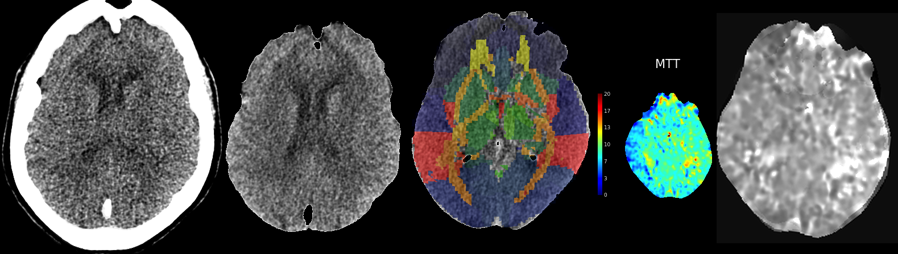

## About
Matlab scripts for CTP perfusion


##### Usage

Input images should be uncompressed NIfTI (.nii) images. These can be created from DICOM using [dcm2niix](https://github.com/rordenlab/dcm2niix).

Consider a folder with the structural scan CTA_Head_Neck with derived maps of CBF, CBV and MTT. One can process these with the command:

```
ct_rgb({'CTA_Head_Neck_4.nii', 'RAPID_rCBV_331.nii', 'RAPID_rCBF_332.nii', 'RAPID_MTT_333.nii'});
```

##### Requirements

To use these scripts you will need

 - Matlab
 - SPM12
 - FSL 
 
##### Methods

The CT RAPID sequence acquired 44 volumes each with 512x512x49 voxels and a resolution of 0.4x0.4x3.0mm, which we refer to as the structural scan. Based on this raw data, Siemens proprietary software generated maps for mean-time-to-transit (MTT), cerebral blood flow (CBF) and crebral blood flow (CBV) each with 256x286x15 voxels with a resolution of 0.8x0.8x10mm. These derived images are stored in a proprietary red-green-blue (RGB) color scheme.

SPM12's realignment function was used to create a mean image of the structural scan, improving the signal-to-noise. FSL's Brain Extraction Tool (BET) scalp stripped the mean structural scan using the method described by Muschelli et al., [2015](https://pubmed.ncbi.nlm.nih.gov/25862260/). The image origin was set to the center of brightness (with CT scans DICOMs use the table center as the origin which provides a poor starting estimate for the anterior commissure). SPM12's normalization routines were used to calculate the deformation required to transform the CT template from the [Clinical Toolbox](https://github.com/neurolabusc/Clinical) (Rorden et al., [2012](https://pubmed.ncbi.nlm.nih.gov/22440645/)) to the native space of the structural scan. This spatial transformation was applied to the atlas maps, using nearest neighbor interpolation to preserve discrete regions. The derived RGB images were converted to scalar maps using a [custom script](https://github.com/neurolabusc/rgb2scalar) and the origin was set to the center of brightness. SPM12's coregistration methods were used to warp these images to match the structural scan. At this stage, both the atlases and the derived images were in the same space. The mean intensity for each atlas parcel was calculated. 


